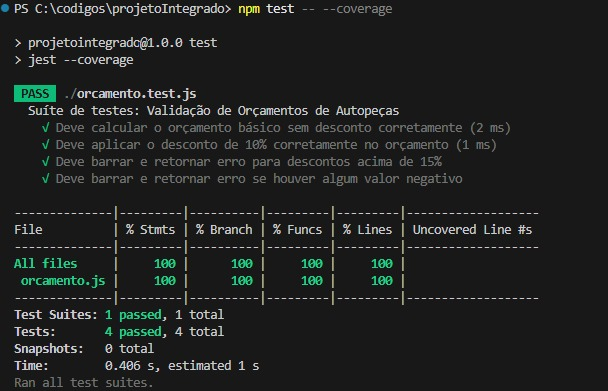

"""# 🚗 AutoCheck - Validador de Orçamentos de Autopeças

> **Projeto Integrado: Arquitetura de Softwares** > 2026 — UNIFEOB  
> **Curso:** Análise e Desenvolvimento de Sistemas (ADS)

Este projeto prático foi desenvolvido para as disciplinas de **Engenharia de Software** e **Teste e Qualidade de Software**. O objetivo principal é aplicar o ciclo de vida de desenvolvimento de software em uma lógica de negócio real, garantindo sua confiabilidade por meio de testes automatizados unitários usando o framework **Jest**.
Alem disso, o projeto utilizou em seu desenvolvimento o modelo incremental, uma vez que as features do projeto vão sendo adicionadas e atualizadas, e testes realizados a cada rodada

---

## ⚙️ 1. O Problema e a Solução
Em uma autopeças ou oficina mecânica, erros manuais ao aplicar descontos e calcular impostos podem gerar prejuízos para o negócio ou insatisfação dos clientes. 

O **AutoCheck** é uma ferramenta escrita em JavaScript que automatiza e valida a criação de orçamentos, garantindo:
1. O desconto nunca ultrapasse o limite de **15% (0.15)** (ou qualquer outro).
2. Valores negativos não sejam aceitos (peças, mão de obra ou desconto).
3. O imposto de **5% (ISS)** seja aplicado de forma correta sobre o subtotal após a aplicação do desconto.

---

## 🏗️ 2. Estrutura de Arquivos
O projeto está estruturado de forma simples e direta com dois arquivos principais:
* 📄 `orcamento.js`: Contém a lógica de negócios e as regras de validação.
* 🧪 `orcamento.test.js`: Contém a suíte de testes unitários para validar todos os fluxos (sucessos e erros).

---

## 🧪 3. Teste e Qualidade de Software (Jest)
Para garantir a qualidade, utilizamos a técnica de testes unitários. A suíte foi desenvolvida utilizando a sintaxe do `it` do **Jest**, facilitando a leitura e o entendimento do código para quem bater o olho.

### Cenários Testados:
* **Caixa-Preta (Requisitos Funcionais):**
  * Cálculo básico do orçamento somando peças e mão de obra com imposto de 5%, sem desconto.
  * Aplicação correta de desconto de 10% com imposto proporcional.
* **Caixa-Branca (Análise de Caminhos de Erro):**
  * Bloqueio e retorno de erro caso o desconto informado seja superior a 15%.
  * Bloqueio e retorno de erro se houver qualquer valor negativo informado.

---

## 🚀 4. Como Executar o Projeto

### Pré-requisitos
Certifique-se de ter o **Node.js** instalado na sua máquina.

### 1. Inicializar o projeto
No terminal da pasta do seu projeto, execute:
    `npm test`

### 2. Instalar o JEST
Instale o Jest como dependencia de desenvolvimento:
    `npm install jest --save-dev`

### 3. Configurar o arquivo package.json
Abra o seu arquivo package.json e altere ou adicione a seção de scripts para ficar assim:
    > "scripts": {
    > "test": "jest"
    > }

### 4. Gerar relatório de cobertura de código
Gerar o relatório exigido na entrega do projeto
    `npm test -- --coverage`
